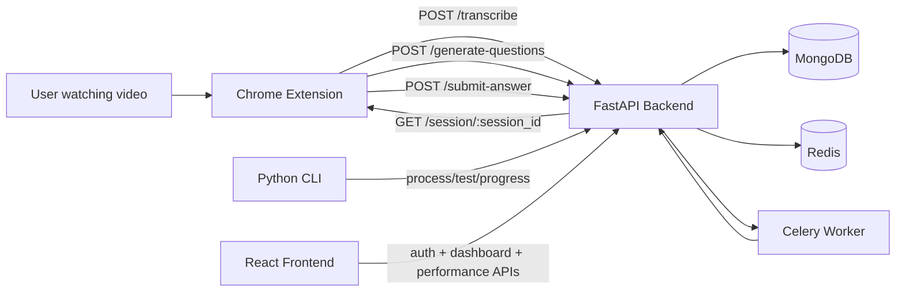
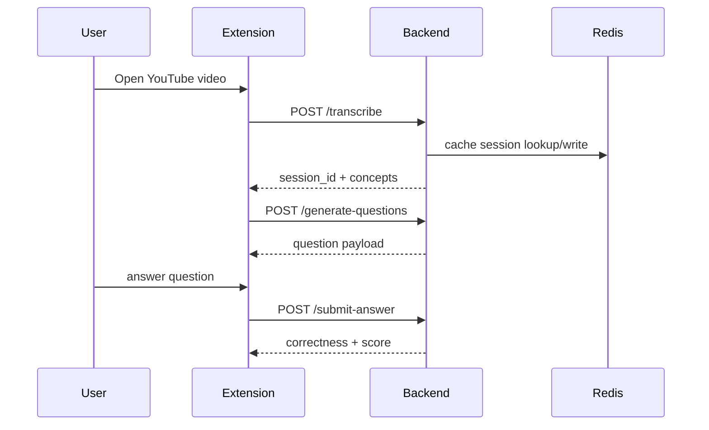

# LearnPulse AI

LearnPulse AI turns educational videos into active recall quizzes. It combines a FastAPI backend, a Python CLI, a Chrome extension, and a React frontend into one local learning workflow.

## What is included

- Backend API for transcript processing, question generation, scoring, and live quiz sessions
- CLI for processing videos, testing sessions, and viewing progress
- Chrome extension that pauses video and asks questions on supported sites
- React frontend for auth, dashboard, and performance views
- Docker Compose stack for MongoDB, Redis, Celery, and the backend

## System architecture and workflow



### Runtime flow



## Current local setup

### Services

- Backend API: http://localhost:8000
- MongoDB: localhost:27017
- Redis: localhost:6379
- Celery worker: background container

### Frontend

- Vite dev server: http://localhost:3000
- Frontend app path: frontend/front

### Extension

- Build output: extension/dist
- Load unpacked from: extension/dist

## Features

| Area                         | Status |
| ---------------------------- | ------ |
| YouTube quiz overlay         | Live   |
| Demo mode (30s)              | Live   |
| Backend question generation  | Live   |
| Session scoring and progress | Live   |
| CLI workflow                 | Live   |
| Auth frontend                | Live   |
| Chrome extension popup       | Live   |

## Quick start

### 1. Start the backend stack

```bash
docker compose up --build -d
```

Check health:

```bash
curl http://localhost:8000/health
```

Expected:

```json
{ "status": "ok", "service": "LearnPulse AI" }
```

### 2. Install CLI dependencies

```bash
python -m pip install -r cli/requirements.txt
```

### 3. Build the extension

```bash
cd extension
npm install
npm run build
```

Load `extension/dist` in Chrome using Developer Mode.

### 4. Start the frontend

```bash
cd frontend/front
npm install
npm run dev
```

Open http://localhost:3000

## Backend API overview

The backend exposes these main endpoints:

- POST /transcribe
- GET /session/{session_id}
- POST /generate-questions
- POST /submit-answer
- GET /performance/{user_id}
- WebSocket /ws/live

### Example smoke tests

```bash
curl http://localhost:8000/health
```

```bash
curl http://localhost:8000/docs
```

```powershell
Invoke-RestMethod -Method POST "http://localhost:8000/transcribe" `
  -ContentType "application/json" `
  -Body '{"video_url":"https://www.youtube.com/watch?v=demo","user_id":"device_test"}'
```

## CLI usage

Run commands from `cli/`:

```bash
python main.py process --url "https://www.youtube.com/watch?v=demo"
python main.py test --session-id demo-session
python main.py progress --user-id cli_user
python main.py test --session-id demo-session --export-path demo_results.json
```

The CLI reads `BACKEND_URL` or `CLI_BACKEND_URL` and defaults to `http://localhost:8000`.

## Extension usage

1. Open Chrome `chrome://extensions/`
2. Enable Developer mode
3. Load unpacked folder: `extension/dist`
4. Open a supported video page
5. Enable Demo Mode in the popup

### Supported demo video

For demo mode, the extension has a local fallback bank for:

- https://www.youtube.com/watch?v=ZzI9JE0i6Lc

If backend fetch fails in demo mode, the extension asks 3 fixed questions instead of stopping.

## Frontend usage

The frontend talks directly to the FastAPI backend.

Configured base URL:

- `VITE_API_BASE_URL=http://localhost:8000`

Main auth/backend routes used by the frontend:

- POST /auth/register
- POST /auth/login
- GET /users/me
- GET /performance/{user_id}

## Recommended environment values

```env
# Backend
MONGODB_URL=mongodb://mongo:27017/learnpulse
REDIS_URL=redis://redis:6379/0
ALLOWED_ORIGINS=http://localhost:3000,http://localhost:5173,http://127.0.0.1:3000,http://127.0.0.1:5173

# CLI
BACKEND_URL=http://localhost:8000

# Frontend
VITE_API_BASE_URL=http://localhost:8000
API_BASE_URL=http://localhost:8000
```

## Repository structure

```text
backend/         FastAPI backend and workers
cli/             Python CLI commands and demo data
extension/       Chrome extension source and dist output
frontend/front/  Vite + React frontend
docs/            Demo and integration docs
```

## Troubleshooting

### Backend not reachable

- Check `docker compose ps`
- Restart with `docker compose up --build -d`

### Extension shows no video response

- Reload the unpacked extension from `extension/dist`
- Refresh the YouTube tab
- Make sure the page is a supported watch page

### Demo mode does not ask questions

- Verify Demo Mode is ON in the popup
- Use the demo video `ZzI9JE0i6Lc`
- Reload the page after reloading the extension

### CLI cannot connect

- Set `BACKEND_URL=http://localhost:8000`
- Confirm backend `/health` returns ok

## Demo checklist

- Docker services are up
- Backend `/health` works
- CLI `process`, `test`, and `progress` run successfully
- Extension loads from `extension/dist`
- Frontend opens on port 3000
- Demo mode works on `ZzI9JE0i6Lc`
